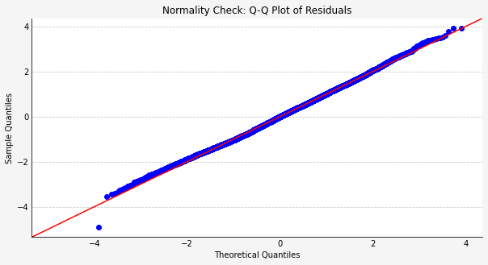

# Phase 2 Project Description
Kings County Housing Analysis with Multiple Linear Regression
##### Overview
A real estate agency in Kingsway seeks to determine the contributing factors that affect the price of houses to make improvements where necessary. They want to employ an analytical approach rather than sentimentality before arriving at a decision. Multiple linear regression has been used for this project to understand how various features affect their pricing to better their services.

##### Business Problem
In the face of market fluctuations and heightened competition within the real estate sector, our agency is grappling with pricing volatility, which poses significant challenges for our agents in devising effective business strategies. We seek strategic guidance to optimize our purchasing and selling endeavors, prioritizing informed decision-making to identify key areas of focus that promise maximum returns on investment.

##### Objectives
To determine the key factors influencing house prices.
To develop multiple linear regression models to predict house prices based on relevant features.
To use insights from the regression analysis to optimize pricing strategies for both purchasing and selling properties.
##### Hypothesis
Null Hypothesis: There is no relationship between our independent variables and our dependent variable.
Alternative Hypothesis: There is a relationship between our independent variables and our dependent variable.
##### Data Understanding
In this project, we utilized the King County House Sales dataset, which serves as the foundational dataset for our analysis. It was sourced from Kaggle. The dataset encompasses comprehensive information regarding house sales within King County, Washington, USA. It comprises a diverse array of features, including the number of bedrooms, bathrooms, square footage, as well as geographical and pricing details of the properties sold. This dataset is frequently employed in data science and machine learning endeavors, particularly for predictive modeling tasks such as regression analysis aimed at forecasting house prices based on the provided features.

##### The Data
The data in this project is real-estate information from King County with over 20000 rows and 21 columns. The data was transformed and cleaned in a number of ways, such as splitting the data into numeric, categoric, and location data, transforming the numeric data to log numeric, splitting the categories to dummy columns, and dropping columns that seem like bad predictors in a linear regression (like latitude and longitude).

##### Methods
To build our predictive model, we perform a 75-25 split into train and test sets and run a multiple linear regression using ordinary-least squares to estimate prices. When we run this model on all of our data, it becomes clear that some of the p-values (which measure confidence) and correlation coefficients (impact) of some columns are less useful, so a few iterations are made to clean up these inputs.

##### Validation
We want to make sure the model is accurate before we use it for anything. graphs suggested that the residuals here are normally distributed compared to the base model. We also want to make sure that the big assumptions for linear regression are not ignored, such as linearity, normality, and homoscedasticity. Linearity and homoscedasticity are specific to every feature, but a sense of normality can be seen in the QQ plot
